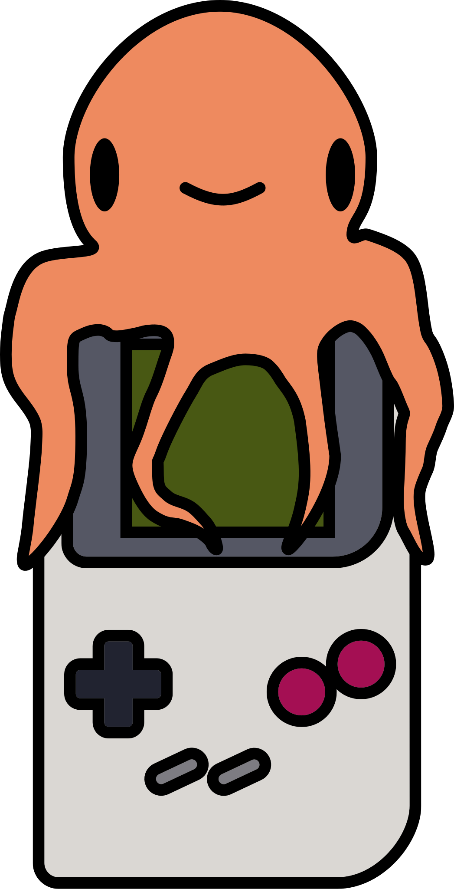
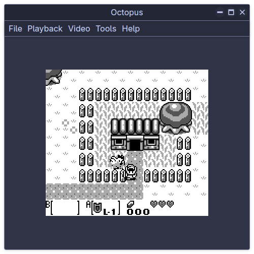
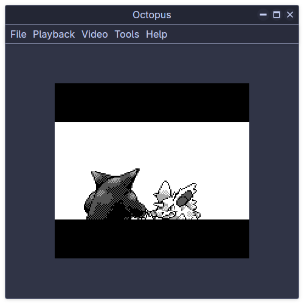

# Octopus GB

A Game Boy emulator written in pure Rust, with a GPUI frontend

  

## Features
- Reasonably accurate CPU
- Pretty good PPU
- Acceptable APU
- Supports MBC0, MBC1 and MBC3 currently
- Flexible rebinding of controls
- Lots of themes
- Debugger with PPU breakpoints and T-cycle stepping
- Dog
- 100% human grown slop

  
  

# Building
Requires Rust Nightly.

Just run `cargo build`

## Default Controls

| Keyboard | Gamepad (Xbox Layout) | GameBoy |
| --- | --- | ---|
| <kbd>W</kbd><kbd>A</kbd><kbd>S</kbd><kbd>D</kbd> | D-Pad or Left Stick | D-Pad |
| <kbd>J</kbd> | B | A |
| <kbd>K</kbd> | A | B|
| <kbd>Backspace</kbd> | Select | Select |
| <kbd>Enter</kbd> | Start| Start |

## Planned Features
- GBC Support
- More MBCs
- More debug tools (tile viewer, tilemap viewer, memory viewer)
- Screen filters
- Custom themes
- Better sync (to audio instead)
- Implement some missing behaviours (LCD disabling, OAM corruption, HALT)
